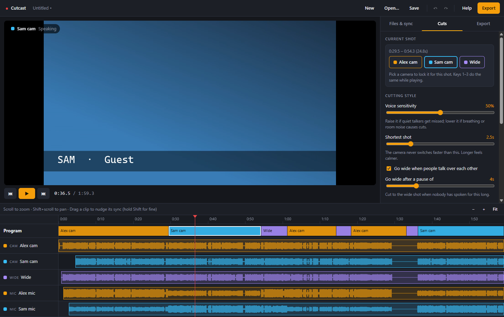

<div align="center">


# Cutcast

**Drop in your podcast's camera and mic files. Get back an edited multicam video.**

Cutcast lines up every recording by its sound, cuts to whoever is talking, and exports one finished MP4
with every microphone mixed underneath. It runs entirely on your own computer.

[](https://github.com/BoazCohenJ/Cutcast/releases/latest)
[](https://github.com/BoazCohenJ/Cutcast/actions/workflows/ci.yml)


https://github.com/user-attachments/assets/7e22c8d7-2897-4ca3-b2fe-3064c291b107



</div>

## Download

Get the latest version from the **[Releases page](https://github.com/BoazCohenJ/Cutcast/releases/latest)**:

| File | What it is |
| --- | --- |
| `Cutcast.Setup.x.y.z.exe` | Installer. Adds Start menu and desktop shortcuts. |
| `Cutcast.x.y.z.exe` | Portable. Nothing to install; just run it. |

> Windows may show a *SmartScreen* warning because the app isn't code-signed yet. Click **More info → Run anyway**.

## Features

- **Automatic sync.** Cameras and mics can start recording at different times; they're lined up by matching their
  audio, accurate to a fraction of a frame. Doubtful matches are flagged so you can check them by ear.
- **Cuts to whoever is talking.** Each mic is linked to that person's close-up camera. Quiet pickup of one person on
  another's mic (bleed) is ignored, and mics recorded at different volumes are handled.
- **Wide-shot logic.** Goes wide when people talk over each other or after a pause, and drops short wide cutaways
  into long monologues at a natural breath.
- **Calm, adjustable pacing.** Set the shortest allowed shot, voice sensitivity and wide-shot rules, and watch the
  cut plan update instantly.
- **Preview before you export.** The built-in player switches cameras exactly the way the export will.
- **Your call wins.** Press `1`–`9` to lock a camera for the current shot and `0` to hand it back.
- **Clean sound.** Every mic plays the whole time and only the picture changes. Loudness can be evened out to the
  podcast standard (−16 LUFS).
- **Fast, reliable export.** Frame-accurate cuts with a progress bar and cancel button, plus NVIDIA, Intel or AMD
  hardware encoding when your computer supports it.
- **Projects and safety nets.** `.cutcast` project files, undo/redo, and automatic autosave that restores your last
  session.

## How to use it

1. **Drop in all of an episode's files**: every camera video and every microphone recording.
2. **Check who's who** in *Files & sync*. Each mic should show the camera that films that person, and your wide
   camera should be set to **Wide shot**. A camera with "wide" in its file name, or the third camera, is picked
   automatically.
3. **Press play** and watch the cuts. Adjust the style in the *Cuts* tab, or lock individual shots.
4. **Export.** Set the start and end with `I` / `O` to trim the pre-show chat, choose quality, and export.

<details>
<summary><b>Keyboard shortcuts</b></summary>

| Keys | Action |
| --- | --- |
| `Space` | Play / pause |
| `←` `→` | Back / forward 1 second (hold `Shift` for 5) |
| `[` `]` | Previous / next cut |
| `1`–`9` | Lock that camera for the current shot |
| `0` | Let the app choose again for the current shot |
| `I` `O` | Set export start / end at the playhead |
| `Ctrl+Z` / `Ctrl+Y` | Undo / redo |
| `Ctrl+S` | Save project |

</details>

## FAQ

**What files does it accept?**
Video: MP4, MOV, MKV, WebM, M4V, AVI. Audio: WAV, MP3, M4A, AAC, FLAC, OGG, Opus, AIFF.

**Does anything get uploaded?**
No. All analysis and rendering happens on your computer with a bundled copy of ffmpeg.

**What's the ideal setup?**
One close-up camera and one microphone per person, plus an optional wide camera. Put each mic close to its speaker
so the app can clearly tell who is talking.

**The preview shows a message instead of video.**
Some phone footage (HEVC) can't play in the preview. It still exports correctly.

## Building from source

Requires [Node.js](https://nodejs.org/) 20 or newer.

```bash
npm install
npm run dev        # run with hot reload
npm test           # cut engine and sync tests
npm run dist:win   # build the installer and portable .exe into release/
```

| Folder | Contents |
| --- | --- |
| `src/shared/` | Cut engine, audio sync and shared types |
| `electron/` | Main process: media analysis, export pipeline, local media streaming |
| `src/renderer/` | React interface: preview, timeline and side panels |
